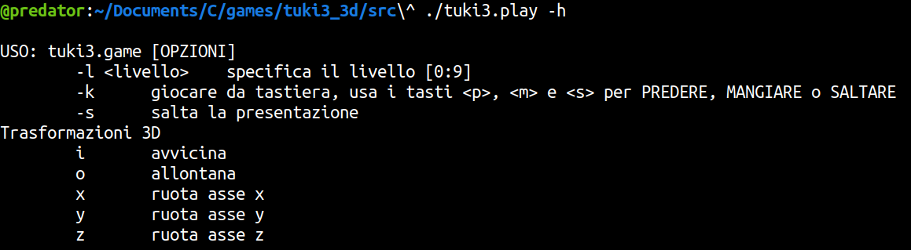
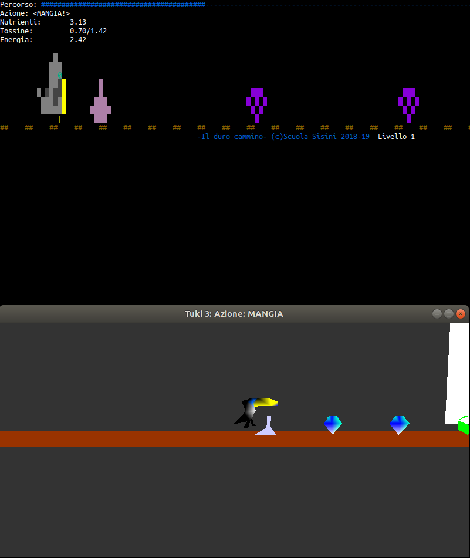

# Tuki3-3d
Tuki3 3d è uno spinoff del progetto [Tuki e Giuli](https://github.com/francescosisini/LIBRO-Sfidare-gli-algoritmi-5-videogiochi-in-C-su-Linux-codice) che 
realizza  una interfaccia 3d con openGL per Tuki3

L'idea è nata per il progetto di Grafica Computerizzata di [Valentina](https://github.com/ValentinaSisini) che prevedeva lo sviluppo di una applicazione 3d implementata con la libreria Open Source per la renderizzazione in 3d OpenGL

## Il gioco-programma
I giochi Tuki e Giuli 1,2,3,4 e 5 sono dei giochi che vengono giocati sviuppando l'algoritmo dell'agent invece che usando un controller o la tastiera. In questa versione del gioco però, ai fini dimostrativi, è possibile anche usare la tastiera

### Per provare il gioco:
- scaricare e installare OpenGL e Glew per Linux
- clonare questo repository
- entrare nella cartella ```src``` e compilare Tuki3_3d con:
```gcc -o tuki3.play tuki3_mvc.c turno_tuki.c view3d.c Utils.c -lglut -lGL -lGLU -lGLEW -lm```
- lanciare ```./tuki3.play -h``` e seguire le istruzioni per giocare






## Credits
La libreria Utils è presa da [OpenGl Book](https://openglbook.com/)
